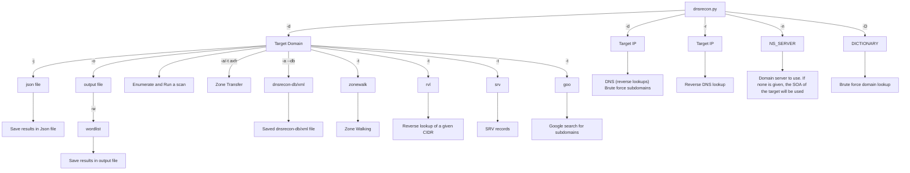

# DNSRecon

DNSRecon is a Python port of a Ruby script that I wrote to learn the language and about DNS in early 2007. 
This time I wanted to learn about Python and extend the functionality of the original tool and in the process re-learn how DNS works and how could it be used in the process of a security assessment and network troubleshooting. 

This script provides the ability to perform:
* Check all NS Records for Zone Transfers.
* Enumerate General DNS Records for a given Domain (MX, SOA, NS, A, AAAA, SPF and TXT).
* Perform common SRV Record Enumeration.
* Top Level Domain (TLD) Expansion.
* Check for Wildcard Resolution.
* Brute Force subdomain and host A and AAAA records given a domain and a wordlist.
* Perform a PTR Record lookup for a given IP Range or CIDR.
* Check a DNS Server Cached records for A, AAAA and CNAME Records provided a list of host records in a text file to check.

# Python Version
DNSRecon requires python3.6+

# Flow Chart

